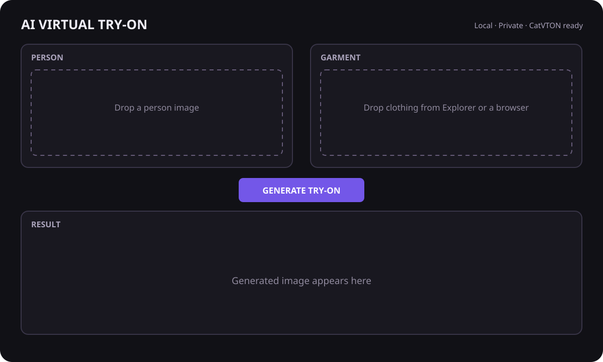

# VirtualTry

VirtualTry is a local-first Windows desktop application for realistic AI virtual try-on. Load a person photo once, drag clothing from Windows Explorer, the desktop, the clipboard, or a compatible browser, and generate repeated try-on results without reloading the model.

The default **mock engine** makes the complete GUI testable without multi-gigabyte downloads. It is visibly labeled and is not presented as AI output. The production engine adapter calls the official [CatVTON](https://github.com/Zheng-Chong/CatVTON) diffusion pipeline—never an OpenCV paste/warp.



## What is implemented

- Native PySide6 dark UI with person, garment, result, and before/after views.
- Explorer, desktop, Qt image-data, clipboard, browser temporary-file, and secure HTTPS URL drops.
- Strict JPEG/PNG/WebP decoding, byte/dimension/pixel limits, metadata removal, and RGB normalization.
- Responsive one-job background inference queue; the model loads once and is reused.
- Request IDs, cooperative cancellation, and stale-result rejection.
- CatVTON upper/lower/overall category support through an isolated adapter.
- CUDA discovery, bf16/fp16 selection, CPU fallback warning, and CUDA OOM recovery.
- In-memory results until explicit PNG/JPEG save; safe timestamped filenames.
- Rotating privacy-aware logs under `%LOCALAPPDATA%\VirtualTry\logs`.
- PyInstaller recipe and model-external packaging strategy.

The detailed design and model evaluation are in [docs/ARCHITECTURE.md](docs/ARCHITECTURE.md).

## Supported environment

- Windows 10 or Windows 11, 64-bit.
- Python **3.9** for the combined CatVTON environment. This is the version specified by the official CatVTON installation guide.
- NVIDIA CUDA GPU recommended. The upstream project reports **under 8 GB VRAM** for 768×1024 with bf16; practical headroom is recommended because the automatic DensePose/SCHP masking stack also consumes memory.
- Ampere-or-newer NVIDIA GPU for bf16. Select fp16 on older compatible CUDA GPUs.
- CPU mode can load when dependencies support it, but diffusion inference may be impractically slow.

CatVTON's official Windows notes call out Detectron2/DensePose installation issues. Visual Studio C++ Build Tools, a CUDA toolkit matching the PyTorch CUDA runtime, and an NVIDIA driver compatible with that runtime may be required.

## Quick start: GUI and mock engine

PowerShell:

```powershell
py -3.9 -m venv .venv
.\.venv\Scripts\Activate.ps1
python -m pip install --upgrade pip
python -m pip install -e .
python app.py
```

The mock engine is selected by default. It validates every input path and exercises drag/drop, paste, worker lifecycle, cancellation, stale-result handling, comparison, and saving without downloading AI weights.

## Real CatVTON setup

CatVTON source, checkpoints, and demo are licensed **CC BY-NC-SA 4.0 for non-commercial use**. Review the [upstream license](https://github.com/Zheng-Chong/CatVTON/blob/main/LICENSE) before downloading. They are not included in this repository or covered by this project's MIT license.

The setup script pins upstream source commit `999bdbe81e6008a3f5749af7c1e0b0fa3d21b48e`, installs the exact published requirements, and downloads only these official model sources:

- `zhengchong/CatVTON`
- `runwayml/stable-diffusion-inpainting`
- `stabilityai/sd-vae-ft-mse`

The last model is placed in the Hugging Face cache because the pinned official CatVTON pipeline names it directly. The application forces Hugging Face offline mode during model loading, so inference cannot silently download missing files. The upstream publisher does not publish a separate checksum manifest; the Git source is pinned to an immutable commit and Hugging Face's content-addressed cache/LFS integrity checks are used for model artifacts. `trust_remote_code=True` is never used.

Run the setup interactively:

```powershell
.\scripts\bootstrap_catvton.ps1
```

Or, after independently reviewing and accepting the model license:

```powershell
.\scripts\bootstrap_catvton.ps1 -AcceptNonCommercialLicense
```

If the base model requires Hugging Face authentication, run `huggingface-cli login` first. No application credentials are stored by VirtualTry.

Then launch VirtualTry, open **Settings**, select **CatVTON**, confirm the three model paths, and choose the device/precision. Model loading happens asynchronously. Expected paths are:

```text
models/
├── CatVTON/                         # pinned official source checkout
└── checkpoints/
    ├── CatVTON/                     # mix attention + DensePose + SCHP
    └── stable-diffusion-inpainting/ # SD 1.5 inpainting base
```

### Exact official model runtime

The pinned upstream requirements are preserved in `requirements-catvton.txt`: PyTorch 2.1.2, torchvision 0.16.2, diffusers 0.29.2, accelerate 0.31.0, transformers 4.27.3, xformers 0.0.23.post1, Pillow 10.3.0, NumPy 1.26.4, OpenCV 4.10.0.84, and their listed helpers. Install the PyTorch build appropriate for your CUDA runtime if the default wheel does not match your system; keep the same PyTorch/torchvision version pair.

## Using the app

1. Click or drop a full-body/person image into **Person**.
2. Drop clothing into **Garment**, or use Paste after copying an image.
3. Choose Upper body, Lower body, or Overall.
4. Click **Generate Try-On**. Optional automatic generation is in Settings.
5. Compare the result and save it explicitly as PNG or JPEG.
6. Drop another garment; the person and loaded model remain available.

Browser drag behavior depends on the browser and page. Direct pixels and browser-created temporary files are preferred. If only a URL is exposed, VirtualTry can fetch it when secure remote images are enabled. Sites that require cookies, authorization headers, JavaScript, or anti-hotlink tokens will not work because the fetcher intentionally sends no browser credentials.

## Security and privacy

Images and generated results stay local by default. There is no upload, analytics, path telemetry, or automatic result retention. A URL is contacted only when the user explicitly drops/pastes it and the remote-fetch setting is enabled.

Remote fetching allows HTTPS port 443 only; rejects credentials, localhost, loopback, private, link-local, reserved, and metadata-service addresses; validates all DNS answers; pins the validated destination IP while retaining hostname TLS verification; revalidates every redirect; limits redirects, MIME types, bytes, and time; and never forwards cookies or application credentials.

Dropped files are never executed. Extensions are not trusted. The decoder verifies content and enforces maximum bytes, dimensions, and decoded pixels. Model source is never dynamically selected from dropped content. Checkpoints come only from explicitly configured local locations.

## Tests

Tests do not download or load CatVTON. The real adapter contract is exercised with mocked pipeline, masker, and generator objects.

```powershell
python -m pip install -r requirements-dev.txt
python -m pytest
python -m ruff check .
```

Coverage includes image validation, MIME parsing, file/dimension limits, SSRF/DNS controls, configuration, output naming, background worker lifecycle, cancellation, stale request protection, result display, error recovery, and the CatVTON adapter call contract.

## Build a Windows executable

The standard build intentionally excludes PyTorch, Diffusers, Transformers, and the model checkpoints; bundling them into one EXE is fragile and extremely large. Build the GUI shell with:

```powershell
.\scripts\build_windows.ps1
```

Output: `dist\VirtualTry.exe`. Keep the `models` directory beside the project/app deployment or set absolute locations in Settings. For a production installer, ship a tested model runtime directory separately and code-sign both installer and executable.

## Troubleshooting

- **Python 3.14 is installed but CatVTON fails:** create the documented Python 3.9 environment. The pinned PyTorch/CatVTON stack predates Python 3.14.
- **CUDA unavailable:** verify `python -c "import torch; print(torch.cuda.is_available(), torch.version.cuda)"`, then reinstall the PyTorch 2.1.2 wheel matching the supported CUDA runtime.
- **Detectron2 build fails on Windows:** install Visual Studio C++ Build Tools and confirm CUDA compiler/runtime compatibility. Upstream Windows support is limited; WSL2 is a fallback for model experimentation but is not the native desktop deployment target.
- **Out of memory:** switch to 384×512, use fp16/bf16 as supported, close other GPU applications, and retry. The app catches CUDA OOM and remains open.
- **Model says incomplete:** confirm the paths in Settings and rerun the explicit bootstrap after inspecting any existing directories. The script refuses to overwrite an existing CatVTON source checkout.
- **Browser drop fails:** save or copy the product image, try another browser, or verify that secure remote URL fetching is enabled. Authenticated/private-network URLs are intentionally rejected.
- **A result is blocked or unexpected:** CatVTON includes the Stable Diffusion safety checker. Try an appropriate source photo; the app does not disable that checker.

## Known limitations

- CatVTON and its checkpoints are non-commercial; this application does not grant commercial model rights.
- Automatic garment extraction from complex product-page screenshots is not included in v0.1; crop the image before loading it.
- Cancellation cannot safely interrupt an active CUDA forward pass. It marks the request cancelled, prevents later stages where possible, and discards the output.
- Progress is indeterminate because the pinned upstream pipeline does not expose a stable step callback.
- The automatic masker adds Detectron2/DensePose installation complexity on native Windows.
- Model quality depends heavily on pose, framing, occlusion, garment catalog quality, and garment category selection.

## Licenses and provenance

- VirtualTry application source: [MIT](LICENSE).
- CatVTON source/checkpoints: [CC BY-NC-SA 4.0](https://github.com/Zheng-Chong/CatVTON/blob/main/LICENSE), external and non-commercial.
- PySide6: LGPLv3/GPL/commercial terms from Qt.
- PyTorch, Pillow, Diffusers, Transformers, and other runtime dependencies retain their own licenses.

Official references: [CatVTON repository](https://github.com/Zheng-Chong/CatVTON), [CatVTON paper](https://arxiv.org/abs/2407.15886), [CatVTON checkpoints](https://huggingface.co/zhengchong/CatVTON), [IDM-VTON repository](https://github.com/yisol/IDM-VTON), and [StableVITON repository](https://github.com/rlawjdghek/StableVITON).
